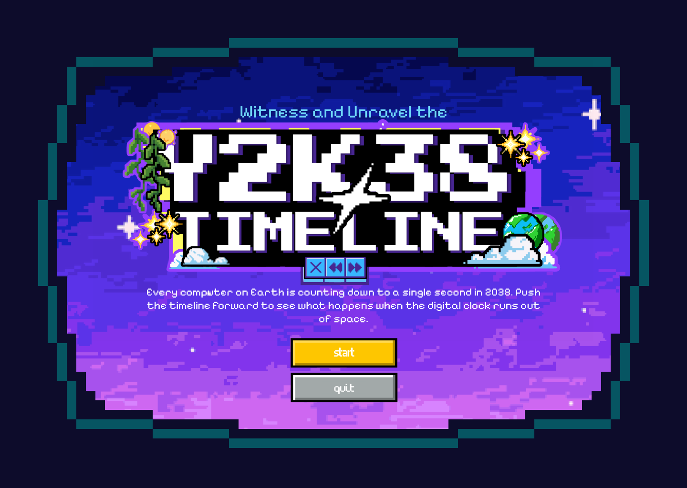

# Incremental Development Log

**Group WDA** — Bantillo, Airon Matthew F. · Chavez, Max Benedict B. · Chiu, Kristopher Lance A. · Ponce, Jean Rondel R. · Santiago, Juan Ramon B.

[Full Proposal](README.md) · [Proposal Document (Google Docs)](https://docs.google.com/document/d/1KCnWIysS6aAWw4uJ-eVQevVSCrbUeSrRp5RZ-RqUPNM/edit?tab=t.0)

---

## Phase 0: Proposal

**Status:** Complete

### Summary

- Defined theme: **The Y2K & Y2K38 Bug — A Journey Through Time and Storage Limits**
- Researched technical background on Unix Epoch, 32-bit signed integers, and integer overflow
- Proposed two interactive elements:
    1. **Timeline Slider** — draggable timeline with industry impact animations at Y2K and Y2K38 crossings
    2. **Unix Epoch Clock** — multi-format clock with fast-forward, overflow, and 64-bit upgrade features
- Outlined tech stack (Astro, React, GSAP), color palette, typography, layout, and accessibility considerations
- Created layout ideas and low-fidelity wireframes for all major screens

### Wireframes

_Begin Exploration — Entry point to the exhibit_

_32-bit Timeline — Default timeline view_

_32-bit Timeline Break — Overflow failure state_

_32-bit Timeline End — Terminal overflow state_

_64-bit Timeline — Post-upgrade resolved state_

_Explore 64-bit Timeline — Branching alternative timeline_

---

## Phase 1: Wireframing & Content Creation

**Status:** Pending

### Summary

- Created wireframes and content for the exhibit
- Developed layout designs for the exhibit pages

### Wireframes

_Title page — Entry screen for the exhibit_

### Aha Moments

- [to be filled]

### Challenges

- [to be filled]

### Creative Decisions

- [to be filled]

---

## Phase 2: Project Setup & Scaffolding

**Status:** Complete

### Summary

- Set up project with Astro, React, and MDX integrations
- Configured global styles, layouts, and GitHub Pages deployment
- Removed template example pages and components

### Aha Moments

- Learned how the template works — just fill up an `.mdx` file and it renders as a page
- Learned how Astro works — content-first, zero JS by default, components hydrate only when needed
- Understood how `client:load` directive tells Astro to hydrate React components

### Challenges

- Trying to understand how the existing codebase works

### Creative Decisions

- Decided to add one exhibit page with the slug `/y2k-38`

---

## Phase 3: Building Title Page

**Status:** Complete

### Summary

- Created TitlePage component with retro TV screen aesthetic
- Implemented hero section with logo, description, and navigation buttons
- Integrated component into y2k-38.mdx exhibit page
- Applied custom CSS styling for background and typography

### Aha Moments

- Learned how to use the layouts of this template:
  - Layouts provide page structure (header, footer, navigation)
  - MDX files specify layout in frontmatter
  - Components can be imported and composed within MDX
  - Layout receives content via `<slot />` component

### Challenges

- Applying the custom design (retro TV screen aesthetic) to the existing layout structure

### Creative Decisions

- Applied the design by creating a separate TitlePage component and importing it into the MDX file, rather than modifying the layout itself
