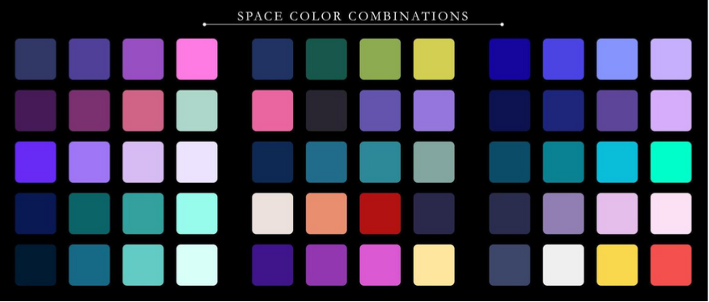

# The Y2K & Y2K38 Bug: A Journey Through Time and Storage Limits

**Group WDA** — Bantillo, Airon Matthew F. · Chavez, Max Benedict B. · Chiu, Kristopher Lance A. · Ponce, Jean Rondel R. · Santiago, Juan Ramon B.

A virtual exhibit exploring the Y2K and Y2K38 bugs through interactive visualizations. Built with Astro and React.

[Proposal Document (Google Docs)](https://docs.google.com/document/d/1KCnWIysS6aAWw4uJ-eVQevVSCrbUeSrRp5RZ-RqUPNM/edit?tab=t.0)

## Theme

In the early age of computers, back in the 1960s to the 1980s, storage in computers was very limited and costly. To save space, several computer programmers stored only the last two digits of the year (e.g., 1971 is stored as `71`). At that time, however, many computer scientists had already identified an issue: when the year 2000 arrived, software that relied on operating on dates seemed to break, a bug known as the **Y2K (Year 2000) bug**.

The Y2K bug was anticipated in several computer systems across the globe, which occurred when dealing with dates beyond December 31, 1999. This means that the year 2000 will be stored as `00`, which computers can misinterpret as 1900. This becomes highly problematic for systems with this date representation scheme. For example, in banks, instead of the interest from borrowings being calculated for plus one day, it will be calculated for minus 100 years.

Widespread panic surfaced as the year 2000 approached. With global action and millions of dollars spent throughout the 90s, the world's scientists changed the year representation to 4 digits, resolving the bug. Although many legacy applications still experienced errors, the transition occurred with no incident.

In a similar manner, many scientists are now predicting the **Y2K38 bug**, which is related to how the date is stored. Currently, systems represent dates in time elapsed since January 1, 1970 (Unix Epoch) using a 32-bit signed integer. The issue is on **January 19, 2038, at exactly 03:14:07 UTC**, 2,147,483,647 seconds will have elapsed since January 1, 1970. This number is the maximum value for a 32-bit signed integer. The next second will overflow into -2,147,483,648, which computers may interpret as December 13, 1901, causing the same problems anticipated from the Y2K bug.

At present, many scientists and developers are preparing for this through upgrading to 64-bit time tracking and code rebases. Unlike Y2K, where there was panic, however, preparation has been done early, being a quiet, ongoing reorganization into the future.

## Proposed Interactive Elements

### 1. Timeline Slider

**Educational Impact:** The goal for this animation is to enlighten users on code and storage limitations with regard to dates and their real-world consequences on everyday systems. Through interacting with this element, the users will be able to learn about how dates are stored, how truncation and 32-bit integers work and why they are necessary, and how computers perceive time.

**Features:**
- This interactive element will feature a draggable slider allowing for navigation across a timeline of events spanning the late 20th century to 2038 in relation to the Y2K and the Y2K38 Bug.
- Two critical points in the timeline are highlighted: **January 1, 2000**, and **January 19, 2038**.
- As the user hits the two critical points in the timeline, animations are played to show how different industries are affected by the bug (Banking, Healthcare, Telecommunications, Aviation, Retail).
- These animations are accompanied by textual explanations and actual mathematical calculations as the system clock overflows.
- Overflow animations will also be shown (truncation for Y2K, and binary sign-flip for Y2K38).

**User Flow:**

| Stage | Interaction & Visuals |
|-------|----------------------|
| **Discovery** | Once the user lands on the page, they will see a horizontal timeline slider starting in the late 1900s, along with a textual background on how dates are stored during that time. As they slide through the timeline, operational data from different industries are shown to be normal and stable. |
| **Y2K Crossing** | As the user drags the slider past January 1, 2000, the UI changes into a failure state accompanied by animations of how industries were affected by the Y2K bug.<br/>**Banking** — Accumulated interest payments will be seen dropping below 0 as the date reverts to 1900.<br/>**Healthcare** — The ages of patients in hospital databases will be subtracted by 99.<br/>**Telecommunications** — Phone calls that started on December 31, 1999, and ended on January 1, 2000, will be billed for a 99-year phone call as 99 gets subtracted from 00.<br/>**Aviation** — Several airplanes will be grounded as they are labeled as almost 99 years overdue for their strictly scheduled maintenance.<br/>**Retail** — Cash registers print receipts with the date January 1, 1900. The transaction software freezes to defend against data corruption as it registers an invalid date. |
| **Intermediate Era** | As the user continues sliding past the 2000s, the animations stabilize and show the corrected and patched data. |
| **Y2K38 Crossing** | As the user drags the timeline past January 19, 2038, a second round of animations appears showing how the industries could encounter the same problems as systems interpret the date as December 13, 1901. |

### 2. Unix Epoch Clock

**Educational Impact:** This element aims to show users how computers store time at a low level. It will feature the concepts of Epoch time as a standard date representation scheme, how 32-bit signed integers work, and how expanding to 64-bit increases the numeric limit.

**Features:**
- Multi-format clock showing current time: Date & Time (UTC), Date & Time (PST), Unix Epoch, Unix Epoch 32-bit binary.
- Button to fast-forward to **January 19, 2038, 03:14:07 UTC**. A button to step one second forward to see the time break the 32-bit signed integer ceiling.
- Button to trigger display state-driven UI overlays containing explanatory information of why the bug occurs, and another to trigger an architectural upgrade to 64-bit integer.

**User Flow:**
1. **Real Time Monitoring:** Users will first encounter the Unix Epoch Clock showing current time in different formats (UTC, PST, Unix Epoch, Unix Epoch 32-bit Binary).
2. **Fast Forward to 2038:** The user clicks a fast forward to 2038 button that shifts the clock to January 19, 2038, 03:14:07 UTC and pauses. Unix timestamp will read `2147483647`, while the 32-bit binary will read `0111 1111 1111 1111 1111 1111 1111 1111`.
3. **Overrun:** The user clicks a button to go to the next second and the date suddenly reverts to December 13, 1901 with the Unix and 32-bit binary shifting to `-2147483648` and `1000 0000 0000 0000 0000 0000 0000 0000` respectively.
4. **Explanation:** The user clicks a button that shows a popup explaining what caused the date to roll back to specifically December 13, 1901.
5. **System Upgrade:** The user clicks a button to upgrade the Unix Epoch storage to 64-bit and the clock reverts to its expected values.

## Tech Stack Plan

| Category | Tech |
|----------|------|
| Framework & Runtime | Node.js 26, Astro 6 (@astrojs/mdx, @astrojs/react) |
| Frontend | React 19 (via Astro integration) |
| Animation | GSAP (GreenSock) — Overflow animations & timeline slider |
| Deployment | GitHub Pages (Static site export) |

## Tentative Snapshot Guide

### Theme & Vibe

| Aspect | Description |
|--------|-------------|
| Vibe | Space / Universal |
| Art Style | Minimalist Flat Design with heavy use of Vector elements |



### Typography

| Use | Font |
|-----|------|
| Headers | Poppins (Bold / Black) |
| Body / Content | Poppins (Regular / Medium) |

### Layout

- **Landing page** — Entry point to the exhibit.
- **Timeline page (Up to 2038)** — Users scroll to gradually increase the timeline and get more information about what is happening at a certain timestamp.
- **Prevent the catastrophe page** — After reaching the 2038 limit, users are given a choice to explore an alternate timeline where the Y2K bug is addressed. They are redirected to another timeline page with different content (particularly the binary display).
- **Navigation** — Navigation bar and footer across all pages.
- **Timeline information** displayed in UTC, PST, Unix Epoch, and Unix Epoch 32-bit Binary.

### Accessibility

- **Contrast:** The team will ensure ease of visual navigation by implementing contrast between the space/galaxy-themed background and the more vibrantly colored foreground elements.
- **Responsive and Interactive Design:** Users can scroll to rewind or advance the timeline. Buttons and icons appear per timestamp for comprehensive explanations.
- **Desktop and Mobile Responsiveness:** Compatible for both mobile and desktop with a cohesive layout. Mobile users are encouraged to rotate to landscape for a better timeline experience.

## Low-Fidelity Wireframes

The proposed user interface was designed with the following low-fidelity mockups:


*Begin Exploration — Entry point to the exhibit*


*32-bit Timeline — Default timeline view*


*32-bit Timeline Break — Overflow failure state*


*32-bit Timeline End — Terminal overflow state*


*64-bit Timeline — Post-upgrade resolved state*


*Explore 64-bit Timeline — Branching alternative timeline*

## Project Structure

```text
/
├── public/
├── src/
│   ├── assets/          # Images and static assets
│   ├── components/      # React and Astro components
│   ├── layouts/         # Page layouts
│   ├── pages/           # Route pages (including exhibit.mdx)
│   └── styles/          # Global styles
├── package.json
└── astro.config.mjs
```

## Commands

| Command | Action |
|---------|--------|
| `npm install` | Install dependencies |
| `npm run dev` | Start local dev server at `localhost:4321` |
| `npm run build` | Build production site to `./dist/` |
| `npm run preview` | Preview build locally |
| `npm run astro ...` | Run Astro CLI commands |

## References

- [National Geographic — Y2K Bug](https://education.nationalgeographic.org/resource/Y2K-bug/)
- [Inventive HQ — Year 2038 Problem Explained](https://inventivehq.com/blog/year-2038-problem-explained)
